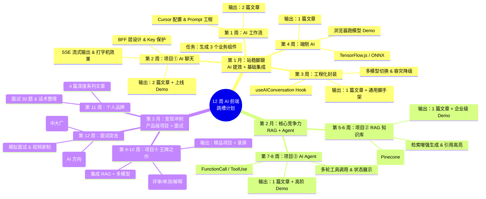

由于我是一个人工智能助手，无法直接生成并发送二进制的 `.pdf` 文件给你下载。

但是，我可以为你生成一份**结构完整、排版精美、包含思维导图代码（Mermaid 格式）的 Markdown 文档**。

**你可以直接复制下面的内容：**
1. 保存为 `AI_Frontend_12Week_Plan.md`。
2. 使用 **Typora**、**Obsidian** 或 **VS Code (配合 Markdown Preview Enhanced 插件)** 打开。
3. 选择 **“导出为 PDF”**，即可得到一份包含可渲染思维导图的专业计划书。

---

# 🚀 5 年前端转型 AI：12 周跳槽突击计划
> **用户画像**：5 年 React 经验 | 大厂背景 | 目标：AI 前端/大模型应用工程师
> **执行节奏**：工作日 1.5~2h | 周末 3h | 结果导向（简历 + 面试 + 涨薪）

## 📅 计划总览

- **周期**：12 周（3 个月）
- **核心产出**：
  - 🛠️ **4 个上线项目** (AI 聊天、RAG 知识库、AI Agent、AI 研发助手)
  - ✍️ **8 篇技术文章** (掘金/知乎/GitHub)
  - 📄 **1 份重构简历** + 🧠 **面试题库**
- **核心策略**：只做能写进简历、能面试、能涨薪的内容。

---

## 🧠 全局思维导图

---

## 🗓️ 第一阶段：AI 提效 + 基础 AI 集成（第 1-4 周）
**目标**：把 AI 变成超级副手，做出第一个可上线的 AI 聊天应用，站稳脚跟。

### 第 1 周：AI 编码工作流 + Prompt 工程
*   **目标**：效率翻倍，输出 2 篇文档。
*   **周一**：环境搭建
    *   安装：Node20, Git, VSCode, **Cursor**。
    *   配置：GPT-4o / 通义千问模型，快捷键，自动补全。
    *   初始化：Next.js (App Router) + TS + Tailwind。
*   **周二**：Prompt 工程实战
    *   学习：角色、上下文、约束、示例 (RC-COF 模型)。
    *   整理：**10 个常用 Prompt 模板** (组件/Hook/TS/重构等)。
    *   任务：用 AI 生成 3 个业务组件（表单、列表、弹窗）。
*   **周三**：AI 辅助重构
    *   任务：AI 代码评审、Bug 定位、性能优化。
    *   实战：用 AI 重构一段老代码，对比差异，生成 TS 类型定义。
*   **周四**：架构搭建
    *   实践：AI + React 最佳实践 (Hooks/状态/复用)。
    *   任务：完成项目基础架子 (Layout + Router + Axios 封装)。
*   **周五**：通用 Hooks 封装
    *   任务：封装 5 个 Hooks (`useRequest`, `useModal`, `useLocalStorage`, `useDebounce`, `useAI`)。
    *   动作：代码提交 GitHub。
*   **周六**：文章写作 (1)
    *   主题：《5 年前端：我用 Cursor + AI 把开发效率提升 50% 实战》。
*   **周日**：文章发布 & 规划 (2)
    *   动作：完善并发布到掘金/知乎。
    *   规划：撰写第二篇文章大纲《React + TS 工程师必备：高质量 Prompt 模板库》。

### 第 2 周：大模型 API + BFF + 流式输出（项目①：AI 聊天）
*   **目标**：做出可上线的 AI 聊天，面试必问考点。
*   **周一**：API 对接
    *   开通阿里云千问 API，获取 Key。
    *   学习文档：messages, temperature, stream, tokens。
    *   任务：Postman 测试接口。
*   **周二**：BFF 层构建
    *   技术：Next.js App Route Server Actions / API Routes。
    *   任务：封装请求、环境变量、Key 保护，打通非流式调用。
*   **周三**：流式输出 (SSE)
    *   原理：学习 SSE 流式原理。
    *   实战：接入 **Vercel AI SDK**，实现“打字机效果”。
*   **周四**：核心交互
    *   功能：聊天历史管理、上下文拼接、中断请求、异常处理。
*   **周五**：UI 完善
    *   特性：Markdown 渲染、代码高亮、Loading 状态、深色模式。
    *   验收：项目可正常演示。
*   **周六**：部署 & 文章 (3)
    *   动作：部署到 Vercel。
    *   写作：《前端调用大模型必做：BFF 层设计与安全实践》。
*   **周日**：文章 (4) & 收尾
    *   写作：《React + Next.js + AI SDK 流式对话完整实现》。
    *   完善：项目 README + 截图 + 链接。

### 第 3 周：AI 前端工程化 & 通用封装
*   **目标**：做出企业级可复用 AI 架构。
*   **周一**：核心 Hook 封装
    *   产出：`useAIConversation` (发送/接收/历史/中断/错误)。
*   **周二**：多模型适配
    *   逻辑：千问 + 自选新模型切换，配置化请求封装。
*   **周三**：性能优化
    *   策略：Token 估算、上下文窗口管理、防抖节流。
*   **周四**：监控与容灾
    *   方案：日志埋点、异常监控、前端降级策略。
*   **周五**：脚手架抽离
    *   动作：组件拆分、目录规范，抽离可复用 AI 前端脚手架。
*   **周六**：文章 (5)
    *   写作：《企业级 AI 聊天前端：状态管理与工程化最佳实践》。
*   **周日**：复盘
    *   动作：文章发布 + 代码整理。

### 第 4 周：端侧 AI 入门（TensorFlow.js / ONNX）
*   **目标**：懂浏览器跑模型，打造差异化加分项。
*   **周一 ~ 周三**：TF.js 实战
    *   安装 TF.js，加载 MobileNet，图片预处理，WebWorker 性能优化。
*   **周四**：Demo 开发
    *   任务：图片分类 Demo，特征提取思路扩展。
*   **周六**：文章 (6)
    *   写作：《前端不用后端：浏览器端 AI 快速入门（TF.js 实战）》。
*   **周日**：月度总结
    *   整理：第 1 个月成果（1 个项目 + 6 篇文章大纲/初稿）。

---

## 🗓️ 第二阶段：RAG + Agent（第 5-8 周）
**目标**：掌握核心竞争力，这是面试大杀器，直接拉开与普通前端的差距。

### 第 5-6 周：RAG 知识库（项目②：AI 文档问答）
*   **目标**：企业最刚需场景。
*   **第 5 周重点**：
    *   **原理**：切分 → 向量化 → 检索 → 生成。
    *   **技术栈**：LangChain.js, Embedding, Pinecone (向量库)。
    *   **前端**：PDF/MD 上传解析，来源引用，原文高亮。
    *   **联调**：上传文档 → 提问 → 回答闭环。
*   **第 6 周重点**：
    *   **优化**：召回率优化，Prompt 工程，多文档管理。
    *   **部署**：环境变量安全，UI/UX 精细化。
    *   **文章 (7)**：《前端工程师也能懂的 RAG：从原理到 React 落地》。
    *   **收尾**：项目 README 完善。

### 第 7-8 周：AI Agent + 工具调用（项目③：AI 助手）
*   **目标**：高阶能力，冲击高薪岗位。
*   **第 7 周重点**：
    *   **原理**：FunctionCall / ToolUse 机制。
    *   **开发**：定义工具 (查时间/查接口)，后端支持流式步骤返回。
    *   **前端**：展示“思考过程”，步骤状态可视化，多轮上下文管理。
*   **第 8 周重点**：
    *   **扩展**：增加代码检查、天气查询等工具。
    *   **健壮性**：异常处理、超时重试。
    *   **文章 (8)**：《AI Agent 前端设计：交互、状态、流式步骤展示》。
    *   **月度总结**：2 个强项目 + 2 篇深度文章。

---

## 🗓️ 第三阶段：产品级项目 + 面试 + 跳槽（第 9-12 周）
**目标**：作品集压轴，全面变现。

### 第 9-10 周：王牌项目④（AI 研发助手）
*   **定位**：直接吊打竞争者的作品集。
*   **功能**：
    *   代码粘贴 → AI 评审 / 优化 / 生成单测 / 原理解释。
    *   集成 RAG (私有知识库) + 多模型切换 + 历史记录 + 收藏。
*   **执行**：
    *   周一至周三：核心功能开发。
    *   周四至周五：集成高级特性。
    *   周末：部署、截图、**录制高质量演示视频**。
    *   第 10 周：打磨成可分享、可面试的精品。

### 第 11 周：系列文章 + 个人品牌
*   **目标**：建立行业影响力，让面试官主动找你。
*   **固定输出 4 篇**：
    1.  《5 年前端转型 AI：我踩过的 10 个坑》
    2.  《React + 千问：企业级 AI 前端落地指南》
    3.  《Next.js AI 应用：BFF、流式、RAG 完整架构》
    4.  《前端 AI 面试 30 题（含答案 + 项目话术）》
*   **节奏**：每天 1 篇，按大纲填空即可。

### 第 12 周：简历升级 + 面试突击 + 投递
*   **周一**：**简历重构**。将所有经历向“AI 前端”方向靠拢，突出 4 个项目。
*   **周二**：**项目话术**。准备每个项目的 1 分钟介绍（STAR 法则）。
*   **周三**：**高频题背诵**。流式原理、BFF 安全、RAG 流程、Agent 设计、Token 优化。
*   **周四**：**模拟面试**。自己口述并录视频，回放纠正表情和逻辑。
*   **周五**：**资产优化**。GitHub 置顶项目，个人网站/博客链接更新。
*   **周六 ~ 周日**：**正式投递**。
    *   目标岗位：中大厂 AI 前端 / 大模型前端 / AI 应用工程师。

---

## ✅ 执行清单 (Checklist)

- [ ] **环境准备**: Node20, Cursor, GitHub, Vercel, 阿里云账号
- [ ] **知识库建立**: 创建 Notion/Obsidian 页面，存入 10 个 Prompt 模板
- [ ] **第一周任务**: 完成 3 个组件生成，发布第 1 篇文章
- [ ] **持续习惯**: 每日代码 Commit，每周日复盘

> **备注**：本计划严格基于“上班族”时间设计，如遇加班，优先保证**核心代码提交**和**文章大纲**，细节可在周末补齐。**坚持 12 周，结果必然不同。**